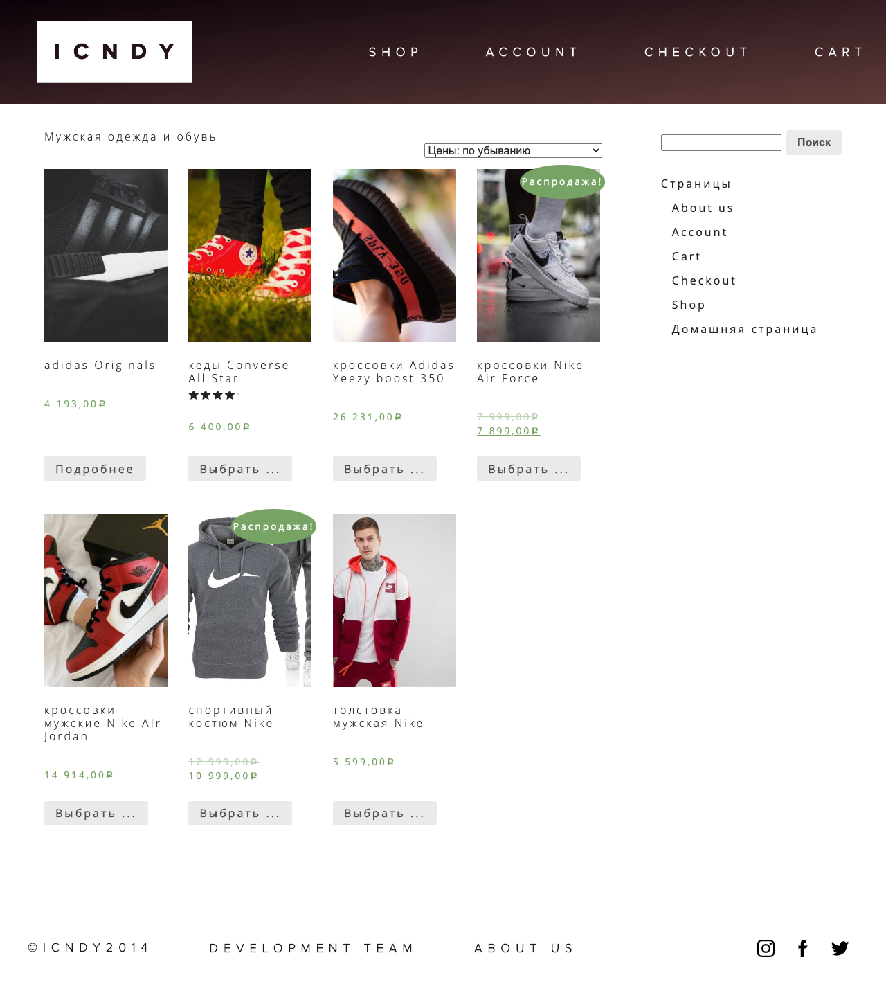
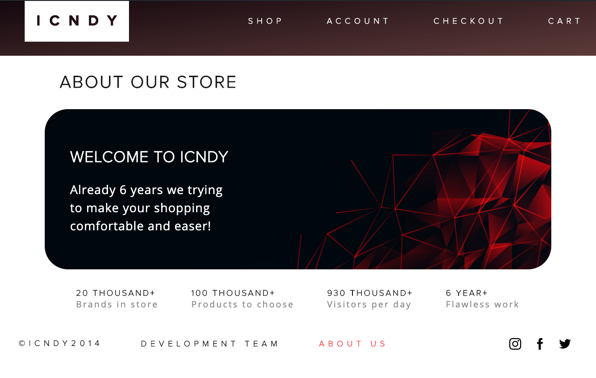
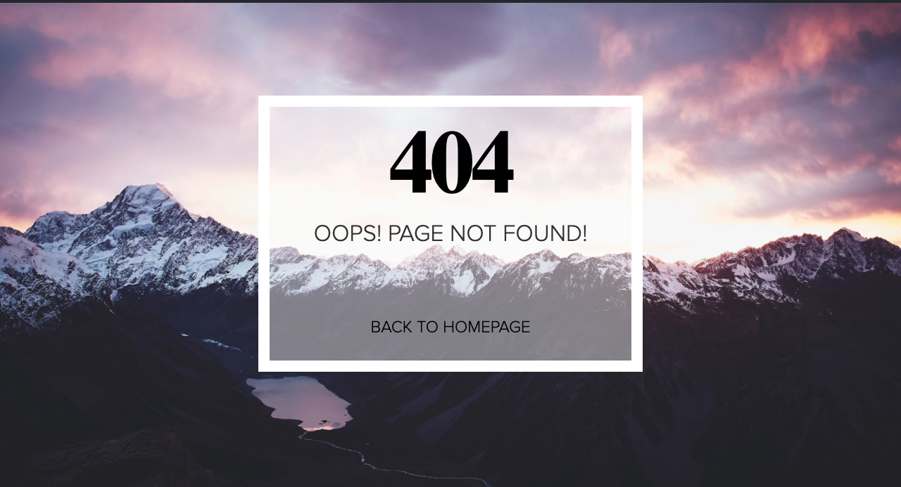

# About repository
This project my first experience in working with CMS. Main task of this project - made working online-store.  
I used a local server MAMP, CMS WordPress and plugin WooCommerce for the logic of the store.  
For a better understanding of the work WP, I didn't take a ready theme and therefore theme for this website was developed personaly by me.  
I took one of my previous projects as the main page of the website and added the online-store logic by WooCommerce.  
Also I add 404 page and one more page - "About us"  
I dosen't not uploaded this website to the server, but you can see the results of the work in the screenshots 
that I will add below. Also you can clone this repository and run it on your server.
# Screenshots

